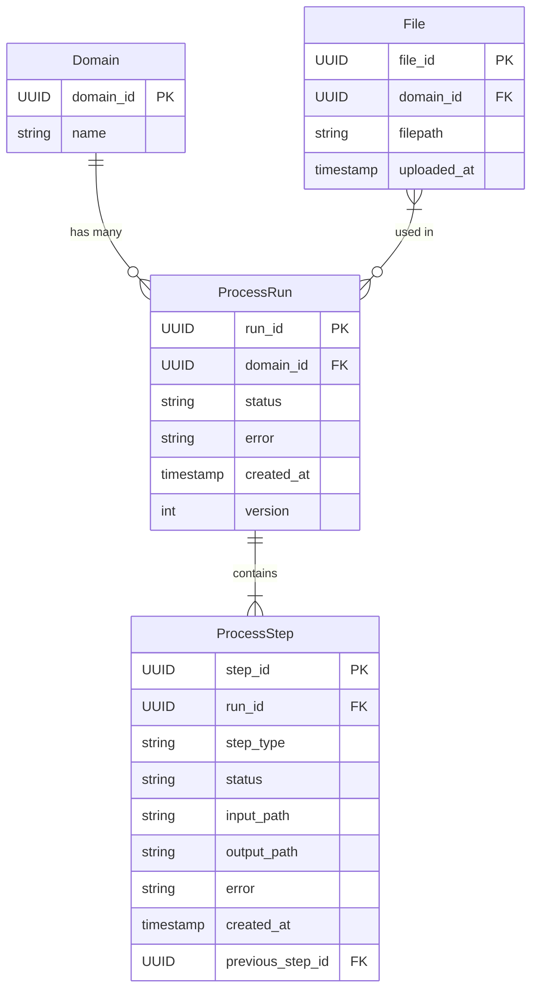
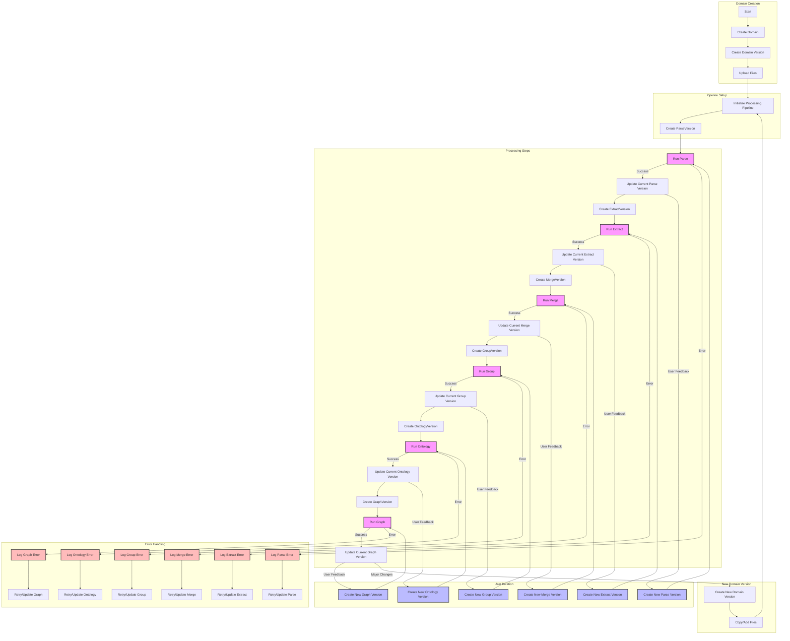
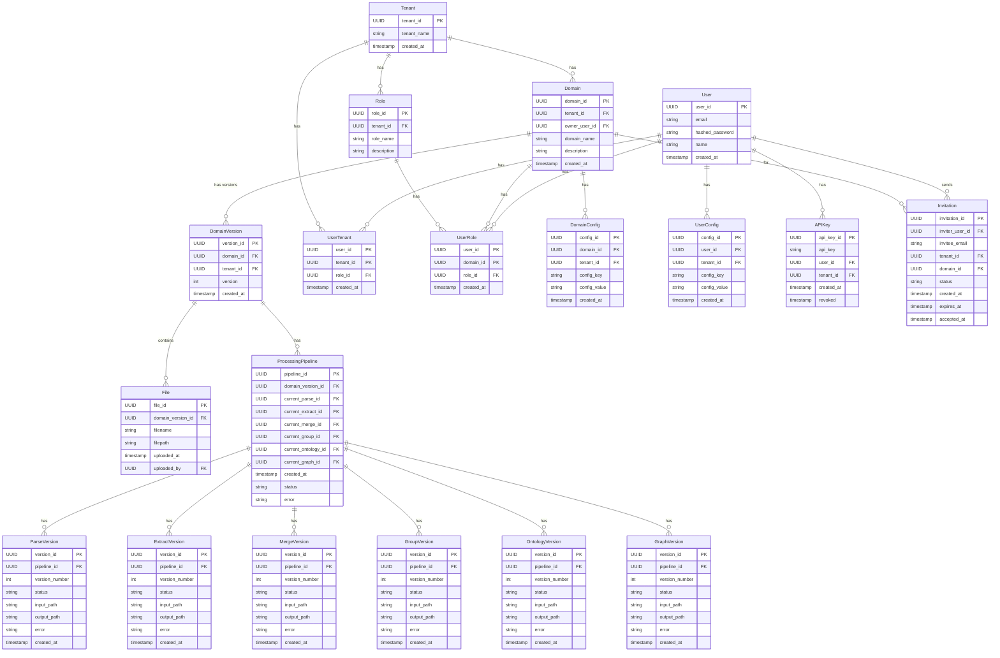

# Domain Knowledge Extraction System

## Architecture Overview

This system extracts, processes, and structures business domain knowledge from various documents into a knowledge graph. The system uses a step-by-step processing pipeline with version control and user validation at each stage.

### Core Components

1. **Domain Management**
   - Organizes knowledge by business domains (e.g., gas bottle sales, medical equipment)
   - Each domain maintains its own set of documents and processing history
   - Supports domain-specific terminology and validation rules

2. **Processing Pipeline**
   - Sequential processing steps with version control
   - User validation and iteration capability at each step
   - Chat-based interaction for modifications and improvements

### Processing Steps

1. **Document Parsing**
   - Converts input documents to markdown format
   - Maintains original document structure
   - Output: Structured markdown files

2. **Entity Extraction**
   - Identifies domain-specific entities
   - Extracts relationships between entities
   - Output: JSON/JSONL files containing entities and relationships

3. **Entity Merging**
   - Combines entities from multiple documents
   - Resolves conflicts and duplicates
   - Output: Consolidated entity list with relationships

4. **Entity Grouping**
   - Organizes entities into logical groups
   - Establishes hierarchy and relationships
   - Output: Grouped entity structure

5. **Ontology Generation**
   - Creates domain-specific ontology
   - Defines entity types and relationships
   - Output: Domain ontology file

6. **Knowledge Graph Generation**
   - Builds final knowledge graph
   - Incorporates all processed information
   - Output: Complete domain knowledge graph

### Data Model



#### Key Entities

1. **Domain**
   - Represents a specific business domain
   - Contains all related files and processing runs

2. **ProcessRun**
   - Represents one complete processing attempt
   - Maintains version control for the entire process
   - Tracks overall status and errors

3. **ProcessStep**
   - Individual steps in the processing pipeline
   - Maintains input and output file paths
   - Links to previous versions for history tracking

4. **File**
   - Tracks uploaded documents
   - Maintains file paths and metadata

### User Interface

```mermaid
flowchart TD
    %% Main Navigation Nodes
    login[Login Screen]
    dash[Domain Dashboard]
    dwork[Domain Knowledge Workspace]
    kgraph[Knowledge Graph]
    uconfig[User Settings]
    dconfig[Domain Settings]
    sconfig[System Settings]

    %% Dashboard Elements and Links
    subgraph "Domain Dashboard"
        dash --> dlist[Domain List<br>- Gas Bottle Sales<br>- Medical Equipment<br>- Industrial Cleaning<br>etc.]
        dash --> metrics[Domain Knowledge Metrics<br>- Entities Count<br>- Relationships<br>- Coverage Areas]
        dash --> recent[Recent Activities]
        dlist --> dnew[+ New Domain]
    end

    %% Domain Workspace Elements
    subgraph "Domain Knowledge Workspace"
        dwork --> vis1[Visualization Area]
        dwork --> chat1[Chat Interface]
        dwork --> docs[Document Manager<br>- Industry Standards<br>- Process Documents<br>- Market Reports]
        dwork --> steps[Knowledge Extraction Steps]
        steps --> s1[1. Parse Documents]
        steps --> s2[2. Extract Domain Entities<br>- Products<br>- Processes<br>- Stakeholders]
        steps --> s3[3. Merge Knowledge]
        steps --> s4[4. Group Concepts]
        steps --> s5[5. Create Domain Ontology]
        steps --> s6[6. Generate Knowledge Graph]
    end

    %% Knowledge Graph Elements
    subgraph "Knowledge Graph View"
        kgraph --> gvis[Domain Knowledge Visualization]
        kgraph --> filters[Knowledge Filters<br>- Entity Types<br>- Relationship Types<br>- Process Flows]
        kgraph --> export[Export Options]
        kgraph --> layers[View Layers<br>- Core Concepts<br>- Processes<br>- Relationships]
    end

    %% Settings Pages
    subgraph "Settings"
        uconfig --> uprefs[UI Preferences]
        uconfig --> uacc[Account Settings]
        
        dconfig --> dent[Domain Entity Types]
        dconfig --> dterm[Domain Terminology]
        dconfig --> dval[Domain Validation Rules]
        
        sconfig --> sproc[Processing Settings]
        sconfig --> sapi[API Configuration]
        sconfig --> sstore[Storage Settings]
    end

    %% Main Navigation Links
    dash --> dwork
    dwork --> kgraph

    %% Settings Access Links
    dash --> uconfig
    dash --> sconfig
    dwork --> dconfig
    dwork --> uconfig
    kgraph --> dconfig

    %% Return Links
    dwork --> dash
    kgraph --> dwork
    uconfig --> dash
    dconfig --> dwork
    sconfig --> dash

    %% Styling
    classDef mainPage fill:#f9f,stroke:#333,stroke-width:2px
    classDef subPage fill:#bbf,stroke:#333,stroke-width:1px
    classDef configPage fill:#bfb,stroke:#333,stroke-width:1px

    class dash,dwork,kgraph mainPage
    class dlist,docs,gvis,filters subPage
    class uconfig,dconfig,sconfig configPage
```



The system provides a chat-based interface for interaction:

1. **Main Views**
   - Domain Dashboard: Overview of all domains and their status
   - Domain Workspace: Processing interface with visualization and chat
   - Knowledge Graph View: Final graph visualization and export

2. **Interaction Model**
   - Chat-based interface for all operations
   - Natural language processing for user commands
   - Interactive visualizations of processing results

3. **User Validation**
   - Each processing step can be validated via chat
   - Users can request modifications or improvements
   - System generates new versions based on feedback

### File Storage

- Files are stored in local storage or S3
- Only file paths are stored in the database
- Organized by domain and processing step
- Version control through separate files for each process run

### Configuration Levels

1. **User Configuration**
   - UI preferences
   - Default views
   - Notification settings

2. **Domain Configuration**
   - Entity types
   - Validation rules
   - Terminology standards

3. **System Configuration**
   - Processing parameters
   - Storage settings
   - API configurations

### Processing Flow



1. **Document Upload**
   - Files are uploaded to storage
   - System creates file records
   - Associates files with domain

2. **Processing Initiation**
   - Creates new ProcessRun
   - Initializes version control
   - Begins sequential processing

3. **Step Processing**
   - Each step creates new ProcessStep record
   - Maintains input/output paths
   - Updates status and error information

4. **Version Control**
   - Each modification creates new version
   - Maintains links to previous versions
   - Enables rollback if needed

### Error Handling

- Each step tracks its own errors
- Full error context stored in database
- Processing can be resumed from failed step
- Version history maintained even for failed runs


### Data Model



### Extension Points

1. **New Process Steps**
   - System designed for easy addition of new steps
   - Each step is independent and versioned

2. **Custom Validation Rules**
   - Domain-specific validation can be added
   - Rules stored in domain configuration

3. **Export Formats**
   - Knowledge graph can be exported in various formats
   - New export formats can be added as needed

This architecture provides a flexible, maintainable system for domain knowledge extraction with strong version control and user validation capabilities.


## Dev

### Launch locally

```
docker-compose down -v && docker-compose up --build
```

